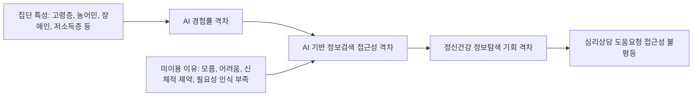

# AI 리터러시/AI 경험과 심리상담 접근성 연구 인수인계 총정리

작성일: 2026-07-03  
작업 폴더: `C:\Users\user\Documents\코덱스 저장소\논문\RESEARCH\korea_ai_counseling_psych_20260623`

## 1. 한 줄 요약

현재까지 만든 연구의 핵심은 “한국 공식통계의 2차 분석을 통해, 생성형 AI 확산 이후 디지털 취약집단의 AI 경험 격차가 정신건강 정보탐색 및 심리상담 접근성의 새로운 불평등 조건이 될 수 있다”는 탐색적 주장이다.

단, 현재 데이터만으로 “AI 리터러시가 우울, 스트레스, 상담 필요성을 직접 증가/감소시킨다”는 인과 주장은 하면 안 된다. 지금 말할 수 있는 것은 “AI 기반 정보탐색·헬스케어·상담형 서비스가 확산되는 상황에서, AI 경험 격차가 심리상담 접근성 격차로 이어질 가능성이 크다”는 구조적·정책적 함의다.

## 2. 현재 가장 좋은 연구 제목

추천 제목:

> AI 리터러시 격차와 심리상담 접근성: 한국 디지털 취약계층의 정보탐색·도움요청 불평등 분석

대안 제목:

- 생성형 AI 확산기 디지털 취약계층의 심리상담 접근성 불평등
- AI 경험 격차는 정신건강 도움요청의 새로운 장벽인가?
- 한국 디지털 취약계층의 AI 정보탐색 격차와 심리상담 접근성

## 3. 핵심 연구 질문

1. 한국 디지털 취약계층은 일반 국민에 비해 AI 서비스를 얼마나 덜 경험하고 있는가?
2. AI 경험 격차는 모든 취약계층에서 동일하게 나타나는가, 아니면 집단별로 다른가?
3. AI 기반 정보검색, 헬스케어, 커뮤니케이션 서비스가 심리상담·정신건강 정보 접근의 경로가 될 때, 어떤 집단이 새롭게 배제될 가능성이 큰가?
4. 기존 디지털 격차, 스마트폰 과의존, 정신건강 지표를 함께 볼 때 “디지털 환경에서의 심리적 도움요청 불평등”을 어떻게 설명할 수 있는가?

## 4. 지금까지 사용한 주요 자료

### 4.1 NIA 디지털정보격차 실태조사

기관: 한국지능정보사회진흥원(NIA)  
사용 연도: 2023, 2024, 2025  
핵심 변수:

- 일반 국민 및 디지털 취약계층별 AI 서비스 경험률
- AI 서비스 인지도
- AI 기반 대화형 정보검색 인지도 및 경험률
- AI 서비스 도움 정도
- AI 미이용 이유

핵심 역할:

이 연구의 중심 데이터다. “AI 경험 격차”를 공식통계 기반으로 보여주는 가장 직접적인 자료다.

### 4.2 NIA 스마트폰 과의존 실태조사

기관: 한국지능정보사회진흥원(NIA)  
사용 연도: 2023, 2024, 2025  
핵심 변수:

- 전체 및 대상별 스마트폰 과의존 위험군 비율
- 과의존군과 일반사용자군의 건강 문제, 가족 갈등, 대인관계 갈등, 학업/업무 어려움 차이

핵심 역할:

AI 자체 자료는 아니지만, 디지털 이용환경이 심리·사회적 문제와 연결된다는 보조 근거로 쓸 수 있다. 다만 이것을 AI 리터러시의 직접 결과처럼 말하면 안 된다.

### 4.3 NIA 사이버폭력 실태조사

기관: 한국지능정보사회진흥원(NIA)  
사용 연도: 2023, 2024, 2025  
핵심 변수:

- AI 활용 사이버폭력 심각성 인식
- AI 활용 가해 경험
- 사이버폭력 피해 후 우울·불안·심한 스트레스 경험

현재 판단:

본 연구의 메인 연결고리로 쓰기에는 부적합하다. 사이버폭력은 개인 내부의 AI 리터러시 문제가 아니라, 대인관계에서 발생한 피해 경험이기 때문이다. 따라서 본문 핵심 분석에서는 빼거나, “AI 시대 온라인 위험환경”을 보여주는 부록·배경 자료로만 쓰는 것이 맞다.

### 4.4 KOSIS 정신건강 후보 자료

현재 상태: 후보 테이블 목록은 수집했으나, 실제 수치 다운로드와 결합은 아직 미완료.

확인된 주요 후보:

- 스트레스 인지율: `DT_117_12_Y067`, 청소년건강행태조사, 2025
- 시군구별 스트레스 인지율: `DT_H_MENTAL_STRESS`, 지역사회건강조사, 2025
- 스트레스 인지율 추이: `DT_11702_N061`, 국민건강영양조사, 2024
- 우울감 경험률: `DT_117_12_Y068`, 청소년건강행태조사, 2025
- 시군구별 우울감 경험률: `DT_H_MENTAL_DEPRESS`, 지역사회건강조사, 2025

핵심 역할:

다음 단계에서 반드시 붙여야 할 자료다. 현재 연구를 “AI 경험 격차”에서 “심리상담·정신건강 접근성” 논문으로 끌어올리려면 KOSIS/KDCA 정신건강 지표가 필요하다.

## 5. 생성된 주요 파일

### 5.1 처리 데이터

폴더:

`C:\Users\user\Documents\코덱스 저장소\논문\RESEARCH\korea_ai_counseling_psych_20260623\data\processed`

주요 파일:

- `paper_ai_experience_panel.csv`: 2023-2025년, 집단별 AI 서비스 경험률 패널
- `paper_integrated_group_year_panel.csv`: 논문 1차 분석용 `연도 x 취약집단` 통합 패널
- `paper_ai_service_summary_metrics.csv`: AI 서비스 인지도, 경험률, 도움 정도, 미이용 이유
- `paper_smartphone_overdependence_summary.csv`: 스마트폰 과의존 위험군 요약
- `paper_smartphone_psych_harm_2025.csv`: 스마트폰 과의존군의 심리·사회적 문제 지표
- `paper_cyber_ai_violence_2025.csv`: AI 사이버폭력 관련 보조 지표
- `kosis_candidate_tables.csv`: KOSIS 정신건강 후보 테이블 목록

### 5.2 기존 요약 산출물

폴더:

`C:\Users\user\Documents\코덱스 저장소\논문\RESEARCH\korea_ai_counseling_psych_20260623\outputs`

주요 파일:

- `00_executive_summary.md`
- `01_data_catalog.md`
- `02_ai_psych_relevant_pages.md`
- `03_research_design.md`
- `04_access_limitations_and_next_steps.md`
- `05_paper_ready_dataset_memo.md`
- `06_preliminary_key_findings.md`

주의:

일부 기존 MD 파일은 콘솔에서 인코딩이 깨져 보일 수 있다. 본 문서는 이어받기용으로 새로 정리한 기준 문서다.

### 5.3 그래프

폴더:

`C:\Users\user\Documents\코덱스 저장소\논문\RESEARCH\korea_ai_counseling_psych_20260623\outputs\charts`

생성 그래프:

- `ai_experience_trends.svg`: 집단별 AI 경험률 추이
- `ai_gap_2025.svg`: 2025년 일반 국민 대비 AI 경험률 격차
- `smartphone_psych_harm_gap_2025.svg`: 스마트폰 과의존군과 일반사용자군의 심리·사회적 문제 격차

## 6. 지금까지 나온 핵심 결괏값

### 6.1 AI 서비스 경험률: 일반 국민

NIA 디지털정보격차 실태조사 기준:

| 연도 | 일반 국민 AI 서비스 경험률 |
|---|---:|
| 2023 | 49.7% |
| 2024 | 51.0% |
| 2025 | 59.4% |

해석:

일반 국민의 AI 서비스 경험률은 2023년 49.7%에서 2025년 59.4%로 증가했다. 생성형 AI가 일상적 정보탐색·업무·학습 도구로 확산되는 흐름이 공식통계에서도 확인된다.

### 6.2 2025년 취약계층별 AI 경험률과 일반 국민 대비 격차

| 집단 | 2025 AI 경험률 | 일반 국민 | 격차 |
|---|---:|---:|---:|
| 고령층 | 30.2% | 59.4% | -29.2%p |
| 농어민 | 31.1% | 59.4% | -28.3%p |
| 장애인 | 35.6% | 59.4% | -23.8%p |
| 저소득층 | 36.7% | 59.4% | -22.7%p |
| 북한이탈주민 | 60.5% | 59.4% | +1.1%p |
| 결혼이민자 | 65.1% | 59.4% | +5.7%p |

핵심 해석:

“취약계층은 모두 AI 경험이 낮다”가 아니다. 고령층, 농어민, 장애인, 저소득층은 일반 국민보다 크게 낮지만, 북한이탈주민과 결혼이민자는 2025년에 일반 국민보다 높다.

이것이 가장 중요한 새 인사이트 중 하나다. 디지털 취약계층을 하나의 덩어리로 보면 안 되고, 집단별 AI 전환 속도가 다르다.

### 6.3 2023-2025년 취약계층별 AI 경험률 변화

| 집단 | 2023 | 2024 | 2025 | 2023-2025 변화 |
|---|---:|---:|---:|---:|
| 북한이탈주민 | 45.4% | 42.9% | 60.5% | +15.1%p |
| 결혼이민자 | 54.5% | 53.9% | 65.1% | +10.6%p |
| 농어민 | 24.4% | 27.1% | 31.1% | +6.7%p |
| 저소득층 | 31.4% | 35.8% | 36.7% | +5.3%p |
| 고령층 | 25.1% | 27.8% | 30.2% | +5.1%p |
| 장애인 | 39.7% | 41.0% | 35.6% | -4.1%p |

핵심 해석:

AI 경험은 전반적으로 늘고 있지만, 증가 속도는 집단별로 다르다. 특히 장애인은 2025년에 오히려 낮아진 것으로 나타나므로 추가 확인이 필요하다. 표본 구성, 문항 변화, 조사 방식 변화, 실제 이용 감소 중 무엇 때문인지 확인해야 한다.

### 6.4 2025년 취약계층의 AI 서비스 인지도와 미이용 이유

주요 수치:

- 취약계층 전체 AI 서비스 인지도: 76.6%
- 취약계층 전체 AI 서비스 비인지도: 23.4%
- AI 기반 대화형 정보검색 인지도: 47.2%
- AI 기반 대화형 정보검색 경험률: 인지자 기준 38.5%

고령층의 주요 미이용 이유:

- “AI를 잘 모름”: 60.9%
- “이용 방법 어려움”: 47.4%
- “기술 거부감”: 19.8%

저소득층의 주요 미이용 이유:

- “이용할 필요성 없음”: 62.0%

장애인의 주요 미이용 이유:

- “신체적 제약”: 17.8%

핵심 해석:

AI 접근성 문제는 단순히 “기기가 있느냐”가 아니다. 고령층은 지식·이용방법 장벽이 크고, 장애인은 신체적 접근성 장벽이 의미 있게 나타난다. 저소득층은 필요성 인식의 문제가 두드러진다. 따라서 심리상담 AI나 정신건강 정보서비스를 설계할 때 집단별 개입 방식이 달라야 한다.

### 6.5 스마트폰 과의존 지표

2025년 스마트폰 과의존 위험군:

- 전체: 22.7%
- 고위험군: 4.1%
- 잠재적 위험군: 18.6%

대상별 2025년 과의존 위험군:

| 대상 | 과의존 위험군 |
|---|---:|
| 청소년 | 43.0% |
| 성인 청년층 | 29.5% |
| 유아동 | 26.0% |
| 성인 중년층 | 16.6% |
| 60대 | 11.5% |

해석:

스마트폰 과의존은 심리·사회적 어려움과 연결되는 디지털 환경 지표다. 하지만 AI 리터러시와 직접 연결된 지표는 아니므로, “디지털 환경이 정신건강·사회관계 문제와 연결된다”는 보조 근거로만 쓰는 것이 안전하다.

### 6.6 스마트폰 과의존군의 심리·사회적 문제 격차

2025년 과의존군과 일반사용자군의 큰 차이:

| 대상 | 지표 | 과의존군 | 일반사용자군 | 격차 |
|---|---|---:|---:|---:|
| 유아동 | 시력/자세 문제 | 65.4% | 12.8% | +52.6%p |
| 60대 | 친구/동료/사회적 관계 갈등 | 53.9% | 1.7% | +52.2%p |
| 60대 | 업무/학업 수행 어려움 | 52.7% | 1.1% | +51.6%p |
| 성인 | 건강 문제 | 55.7% | 9.3% | +46.4%p |
| 성인 | 업무/학업 수행 어려움 | 47.8% | 3.5% | +44.3%p |

해석:

디지털 이용 문제가 심리상담 수요나 정신건강 지원 필요성과 연결될 수 있음을 보여주는 보조 자료다. 그러나 이것은 “AI 경험 격차”의 결과가 아니다. 논문에서는 별도 축으로 조심스럽게 써야 한다.

### 6.7 사이버폭력 지표

2025년 주요 수치:

- AI 활용 사이버폭력이 심각하다고 보는 비율: 청소년 89.4%, 성인 87.6%
- AI 활용 가해 경험: 청소년 가해자 중 2.2%, 성인 가해자 중 2.6%
- 사이버폭력 피해 후 우울·불안·심한 스트레스 경험: 청소년 16.0%, 성인 27.7%

현재 결론:

이 수치는 흥미롭지만, 본 연구의 중심 논리인 “AI 리터러시 격차와 심리상담 접근성”에는 바로 붙이면 논리적 연결이 약해진다. 사이버폭력은 대인관계적 피해 경험이며, AI 리터러시 부족이나 AI 경험 격차의 직접 결과가 아니다.

따라서 본문에서는 제외하거나, 서론에서 “AI가 온라인 위험환경도 변화시키고 있다”는 배경 정도로만 언급하는 것이 좋다.

## 7. 지금 가능한 결론

### 7.1 가능한 결론

가능한 결론은 다음이다.

> 생성형 AI가 정보검색, 건강정보 탐색, 상담형 인터페이스의 경로로 확산되는 상황에서, 한국의 디지털 취약계층 내부에는 AI 경험률의 큰 차이가 존재한다. 특히 고령층, 농어민, 장애인, 저소득층은 일반 국민 대비 AI 경험률이 20%p 이상 낮아, 향후 AI 기반 정신건강 정보·심리상담 서비스가 확대될수록 도움요청 접근성에서 추가적인 불평등을 겪을 가능성이 있다. 반면 북한이탈주민과 결혼이민자는 2025년에 일반 국민보다 높은 AI 경험률을 보여, 취약계층 내부의 이질성을 고려한 정책 설계가 필요하다.

### 7.2 하면 안 되는 결론

현재 데이터만으로 다음 주장은 하면 안 된다.

- AI 리터러시가 낮아서 우울감이 높아졌다.
- AI를 많이 쓰면 심리상담 접근성이 실제로 높아진다.
- AI 경험률이 낮은 집단이 정신건강이 더 나쁘다.
- 사이버폭력 피해가 AI 리터러시 격차 때문에 발생했다.

이런 주장을 하려면 개인 단위 원자료, 정신건강 지표, 상담 이용 지표, 통제변수, 인과모형이 필요하다.

## 8. 이 연구가 새롭다고 말할 수 있는 범위

### 8.1 새롭지 않은 부분

다음 사실 자체는 새롭지 않다.

- 디지털 취약계층이 존재한다.
- 고령층이 디지털 기술 이용에서 상대적으로 불리하다.
- 스마트폰 과의존이 심리·사회적 문제와 관련된다.
- 사이버폭력 피해가 우울·불안·스트레스와 관련된다.

이것들은 기존 연구와 공식통계에 이미 있는 내용이다.

### 8.2 새롭게 만들 수 있는 부분

새로움은 “자료 자체”보다 “자료를 붙이는 방식과 해석 프레임”에 있다.

1. NIA 디지털정보격차 실태조사의 AI 서비스 문항을 2023-2025년 집단별 패널로 재구성했다.
2. AI 경험 격차를 단순 기술수용 문제가 아니라, 정신건강 정보탐색·심리상담 도움요청 접근성의 조건으로 해석했다.
3. 취약계층 내부의 이질성을 드러냈다. 고령층·농어민·장애인·저소득층은 낮지만, 북한이탈주민·결혼이민자는 높다.
4. 생성형 AI 시대에는 기존 디지털 격차가 “정보 접근 격차”를 넘어 “정신건강 도움요청 경로의 격차”로 바뀔 수 있다는 정책 가설을 제시했다.

따라서 논문에서는 다음처럼 쓰는 것이 안전하다.

> 본 연구는 한국 공식통계의 2차 분석을 통해, 생성형 AI 확산 이후 디지털 취약집단의 AI 경험 격차가 정신건강 정보탐색 및 심리상담 접근성의 새로운 불평등 조건이 될 수 있음을 탐색적으로 제시한다.

## 9. 논리 구조: 무엇과 무엇을 붙였는가

현재까지 실제로 붙인 것은 다음이다.

### 9.1 핵심 결합

NIA 디지털정보격차 실태조사:

`연도 x 집단 x AI 서비스 경험률`

여기에 같은 보고서의 AI 관련 보조 문항을 붙였다.

`AI 서비스 인지도 + AI 기반 대화형 정보검색 경험 + AI 서비스 도움 정도 + 미이용 이유`

이 결합을 통해 다음 해석이 가능해졌다.

- 어떤 집단이 AI 경험에서 배제되는가?
- 배제 이유가 지식 부족인지, 이용방법 어려움인지, 필요성 인식 부족인지, 신체적 제약인지?
- AI가 심리상담 정보탐색의 경로가 될 때 어떤 집단이 불리한가?

### 9.2 보조 결합

NIA 스마트폰 과의존 실태조사:

`대상 x 과의존 여부 x 건강/관계/업무·학업 어려움`

이 자료는 디지털 이용환경이 심리·사회적 어려움과 연결된다는 배경 근거다. 하지만 AI 경험률과 직접 결합된 개인 단위 자료는 아니므로, 논문에서는 “보조 지표”로만 써야 한다.

### 9.3 제외 또는 축소해야 할 결합

NIA 사이버폭력 실태조사:

`AI 활용 사이버폭력 인식/경험 + 피해 후 심리상태`

처음에는 AI와 심리상태를 연결하는 자료로 고려했지만, 사용자의 지적대로 논리적 연결이 어색하다. 사이버폭력은 대인관계적 피해이고, 본 연구의 중심인 AI 리터러시·AI 경험 격차와는 다른 축이다.

따라서 현재 연구의 메인 모델에서 제외하는 것이 맞다.

## 10. 현재 연구모형

추천 모형:

중요:

이 모형은 현재 “검증 완료된 인과모형”이 아니라 “공식통계 기반 탐색모형”이다. 논문에서는 탐색적 분석, 정책 가설, 2차 자료 분석이라고 표현해야 한다.

## 11. 추가로 반드시 해야 할 분석

### 11.1 KOSIS/KDCA 정신건강 지표 실제 다운로드

해야 할 일:

- `kosis_candidate_tables.csv`에서 스트레스 인지율, 우울감 경험률, 자살생각률, 상담 경험, 정신건강 서비스 이용 관련 테이블을 선별한다.
- 실제 수치를 다운로드한다.
- 연도, 연령대, 성별, 지역 단위로 정리한다.

목표:

AI 경험 격차 자료와 정신건강 지표를 직접 또는 간접 결합할 수 있는 형태로 만든다.

### 11.2 상담 접근성 지표 찾기

현재 빠져 있는 가장 중요한 축은 “심리상담 접근성” 자체다.

찾아야 할 후보:

- 정신건강복지센터 이용률
- 심리상담 경험률
- 정신건강 서비스 미이용 이유
- 우울감 경험 후 도움요청 여부
- 자살생각 후 상담/치료 경험
- 청소년 상담 경험 또는 도움요청 대상
- 보건복지부 정신건강실태조사 관련 통계

이 자료가 붙으면 논문 설득력이 크게 올라간다.

### 11.3 개인 단위 원자료 확보 가능성 확인

현재 자료는 주로 공개 PDF와 집계표 기반이다. 더 강한 논문을 쓰려면 개인 단위 원자료가 필요하다.

확인할 것:

- NIA 디지털정보격차 실태조사 마이크로데이터 공개 여부
- 스마트폰 과의존 실태조사 마이크로데이터 공개 여부
- 한국복지패널, 한국의료패널, 국민건강영양조사 원자료에서 디지털 이용/정신건강/상담이 같이 있는지
- 청소년건강행태조사 원자료에서 인터넷 사용, 우울감, 스트레스, 도움요청 관련 문항 결합 가능성

개인 단위 자료가 확보되면 가능한 분석:

- 로지스틱 회귀
- 다항 로지스틱 회귀
- 매개효과 분석
- 조절효과 분석
- 잠재계층분석
- 구조방정식

### 11.4 AI 정보탐색 접근성 지수 만들기

현재 자료로 만들 수 있는 지수:

`AI 정보탐색 접근성 취약성 지수`

구성 후보:

- AI 서비스 경험률 격차
- AI 기반 대화형 정보검색 인지도
- AI 기반 대화형 정보검색 경험률
- AI 미이용 이유 중 “AI를 잘 모름”
- AI 미이용 이유 중 “이용 방법 어려움”
- AI 미이용 이유 중 “신체적 제약”
- 디지털 조력자 또는 사회적 지원 관련 문항

주의:

지수는 임의성이 크므로, 본문에서는 “탐색적 지수”로 제시하고 민감도 분석을 해야 한다.

## 12. 논문 작성 시 추천 구성

### 12.1 서론

핵심 논지:

생성형 AI는 정보검색, 행정서비스, 헬스케어, 상담형 인터페이스의 경로가 되고 있다. 따라서 AI 리터러시 격차는 단순한 기술 이용 격차가 아니라 도움요청과 심리상담 접근성의 격차로 확장될 수 있다.

### 12.2 선행연구

정리할 축:

- 디지털 정보격차
- AI 리터러시와 생성형 AI 이용
- 정신건강 정보탐색과 도움요청 행동
- 디지털 헬스 및 AI 상담 서비스
- 취약계층의 정보 접근성

### 12.3 자료 및 방법

자료:

- NIA 디지털정보격차 실태조사 2023-2025
- NIA 스마트폰 과의존 실태조사 2023-2025
- KOSIS/KDCA 정신건강 지표
- 가능하면 상담 접근성 지표

분석:

- 집단별 기술통계
- 연도별 변화
- 일반 국민 대비 격차
- 집단별 미이용 이유 비교
- 정신건강/상담 접근성 지표와의 생태학적 결합

### 12.4 결과

추천 결과 순서:

1. 일반 국민과 취약계층의 AI 경험률 변화
2. 2025년 집단별 AI 경험률 격차
3. 취약계층 내부의 이질성
4. AI 미이용 이유의 집단별 차이
5. 정신건강/상담 접근성 지표와의 탐색적 결합
6. 스마트폰 과의존 자료를 통한 디지털 심리위험 보조 분석

### 12.5 논의

핵심 함의:

- AI 상담 서비스 확대는 접근성 향상만이 아니라 배제 위험도 동시에 만든다.
- 고령층·농어민·장애인·저소득층은 AI 기반 도움요청 체계에서 우선 개입 대상이다.
- 결혼이민자·북한이탈주민은 “취약계층이지만 AI 경험률이 높은 집단”으로 별도 해석이 필요하다.
- AI 리터러시 정책은 심리상담·정신건강 서비스 정책과 연결되어야 한다.

## 13. 가장 조심해야 할 한계

1. 현재 자료는 대부분 집계자료다. 개인 수준 인과관계를 검증한 것이 아니다.
2. NIA 취약계층 구분과 KOSIS 정신건강 구분이 완전히 일치하지 않을 수 있다.
3. AI 경험률은 AI 리터러시 전체를 대표하지 않는다.
4. AI 서비스 경험이 심리상담 이용으로 이어졌는지는 현재 자료만으로 알 수 없다.
5. 스마트폰 과의존은 AI와 직접 같은 변수가 아니다.
6. 사이버폭력은 대인관계 피해이므로 본 연구의 핵심 경로로 쓰면 논리적 비약이 생긴다.
7. 2025년 장애인 AI 경험률 하락은 추가 검증이 필요하다.
8. PDF에서 추출한 수치는 원보고서 표와 대조 검증해야 한다.

## 14. 지금 사용자가 미처 고려하지 않았을 수 있는 것

### 14.1 “AI 상담 접근성”은 이용 가능성만이 아니라 신뢰 문제다

AI 상담 서비스가 있어도 취약계층이 신뢰하지 않거나, 개인정보 노출을 두려워하거나, 자신의 문제를 AI에 말하는 것을 부적절하다고 느끼면 실제 도움요청으로 이어지지 않을 수 있다.

따라서 후속 연구에서는 다음 문항을 찾는 것이 좋다.

- AI 신뢰도
- 개인정보 우려
- AI 추천 정보 신뢰 여부
- 비대면 상담 선호도
- 정신건강 낙인

### 14.2 “고령층”은 가장 중요한 집단일 가능성이 높다

고령층은 AI 경험률 격차가 가장 크고, 미이용 이유에서도 “모름”과 “이용방법 어려움”이 크다. 동시에 정신건강 서비스 접근성, 고립, 만성질환, 디지털 정보 탐색 어려움이 겹칠 가능성이 있다.

논문을 좁힌다면 고령층 중심 연구가 가장 선명하다.

### 14.3 장애인은 별도 연구로도 가치가 있다

장애인은 AI 경험률이 2025년에 낮아졌고, 미이용 이유에서 신체적 제약이 나타난다. AI는 원래 접근성 보조기술이 될 수 있지만, 실제로는 접근성 장벽을 재생산할 수도 있다.

장애인에 초점을 두면 “AI 접근성의 역설”이라는 강한 논문 주제가 된다.

### 14.4 결혼이민자와 북한이탈주민의 높은 AI 경험률은 그냥 예외가 아니다

이 두 집단은 언어 번역, 생활정보 검색, 행정·교육 정보 탐색 등에서 AI 활용 필요가 클 수 있다. 따라서 “취약계층 = 낮은 AI 경험”이라는 단순 가정을 깨는 중요한 발견이다.

후속 분석에서 이 집단을 따로 해석하면 논문 독창성이 커진다.

### 14.5 심리상담사의 역할 변화도 논문 함의에 넣을 수 있다

AI가 심리상담사를 대체한다는 프레임보다, 상담사가 AI 정보격차를 이해하고 내담자의 디지털 도움요청 경로를 함께 설계해야 한다는 프레임이 더 안전하고 설득력 있다.

예:

- 상담 초기 면접에서 디지털 정보탐색 능력 확인
- AI 정신건강 정보의 오남용 여부 확인
- 고령층·장애인 내담자에게 공공 상담 자원 연결
- AI 챗봇 이용 경험과 신뢰 수준 파악

## 15. 다음 작업 체크리스트

우선순위 1:

- KOSIS/KDCA 정신건강 실제 수치 다운로드
- 상담 접근성 지표 찾기
- 사이버폭력 자료는 본문 메인 모델에서 제외

우선순위 2:

- 원보고서 PDF 표와 CSV 수치 교차검증
- 2025년 장애인 AI 경험률 하락 원인 확인
- AI 기반 대화형 정보검색 문항을 집단별로 더 세분화

우선순위 3:

- 논문용 표 3개 만들기
  - 집단별 AI 경험률 추이
  - 2025년 일반 국민 대비 격차
  - AI 미이용 이유의 집단별 차이
- 논문용 그림 2개 만들기
  - AI 경험률 추이 그래프
  - AI 정보탐색 접근성 취약성 지도 또는 지수 그래프

우선순위 4:

- 선행연구 최신 논문 검색
- 연구모형 확정
- 초록, 서론, 방법, 결과 초안 작성

## 16. 다른 AI에게 바로 넘길 때 쓸 프롬프트

아래 문장을 다른 AI나 새 창에 그대로 붙여 넣으면 된다.

> 한국 자료를 활용해 “AI 리터러시/AI 경험 격차와 심리상담 접근성”에 관한 탐색적 논문을 준비 중이다. 현재 NIA 디지털정보격차 실태조사 2023-2025에서 일반 국민 및 취약계층별 AI 서비스 경험률, AI 기반 대화형 정보검색 인지도/경험률, AI 미이용 이유를 추출했고, 스마트폰 과의존 실태조사는 디지털 환경과 심리·사회적 문제의 보조 근거로만 사용한다. 사이버폭력 자료는 대인관계 피해라서 메인 모델에서 제외한다. 핵심 발견은 2025년 일반 국민 AI 경험률 59.4% 대비 고령층 30.2%, 농어민 31.1%, 장애인 35.6%, 저소득층 36.7%로 낮지만, 북한이탈주민 60.5%, 결혼이민자 65.1%는 일반 국민보다 높다는 점이다. 다음 단계는 KOSIS/KDCA 정신건강 지표와 상담 접근성 지표를 붙여 “AI 정보탐색 접근성 격차가 심리상담 도움요청 불평등의 조건이 될 수 있다”는 탐색적 논문 구조를 완성하는 것이다. 인과 주장은 피하고, 공식통계 2차 분석과 정책 함의 중심으로 정리해 달라.

## 17. 최종 판단

이 연구는 “완전히 새로운 원자료 분석”은 아직 아니다. 그러나 한국 공식통계에서 AI 경험 격차를 추출해 정신건강 정보탐색·심리상담 접근성 문제로 재해석하는 프레임은 충분히 새롭고 논문화 가능성이 있다.

가장 강한 방향은 사이버폭력이 아니라 다음 축이다.

> AI 경험 격차 → AI 기반 정보검색 접근성 격차 → 정신건강 정보탐색/도움요청 접근성 격차

이 방향으로 가면 논리적 비약이 줄고, 심리상담 전공과도 자연스럽게 연결된다.
