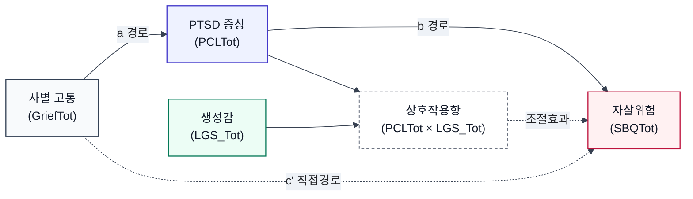

# Figure. Generativity-Moderated Indirect Association From Grief to Suicide Risk

Note. The model represents a cross-sectional moderated indirect association. Grief severity was indirectly associated with suicide risk through PTSD symptoms. This indirect association was evident at low and average levels of generativity, but not at high levels of generativity.
